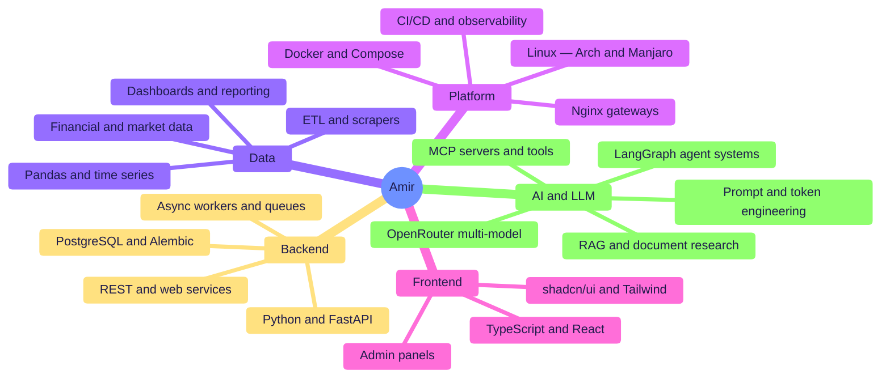
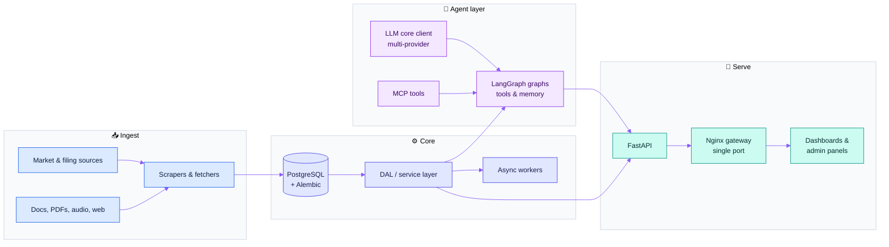
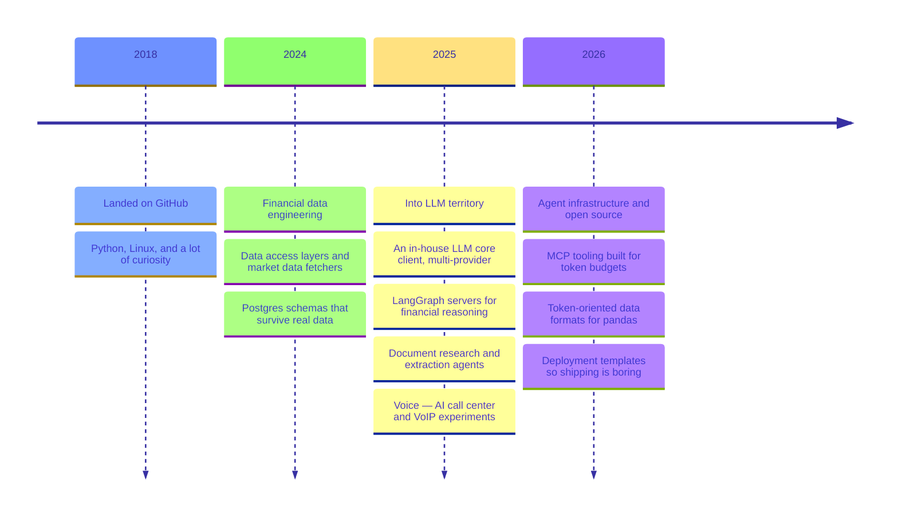
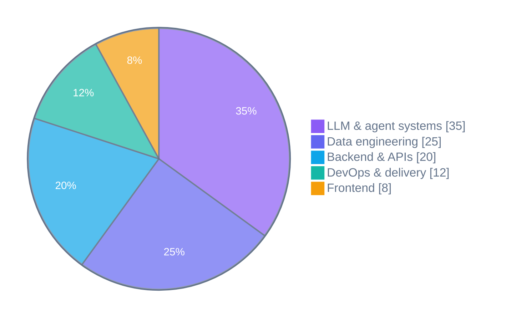

<div align="center">


<p>
  <a href="https://AMSeify.me"></a>
  <a href="https://twitter.com/AMSeify"></a>
  <a href="mailto:amh.seify@gmail.com"></a>
  
</p>

<sub>🐍 Python · 🐧 Arch & Manjaro · 🤖 LLM agents · 🏦 Financial data · 🚢 Docker all the way down</sub>

</div>

---

## 👋 whoami

```python
class AmirSeify:
    role      = "Python Developer → MLOps"
    based_in  = "Tehran, Iran"
    building  = "theRadioCode.com"
    daily     = ["LLM agents", "financial data pipelines", "things in containers"]
    daily_os  = ["Manjaro 🟢", "Arch 💙"]
    obsession = "doing more with fewer tokens"
    motto     = "Let's Rock'n'Roll 🤘"
```

I started as a Python developer and drifted into **MLOps** — and never came back. These days
my work sits in the overlap between two worlds: **messy financial data** on one side, and
**LLM agent systems** on the other. I pull market data into shape, build agent graphs on top
of it, and ship the whole thing behind Docker, Nginx and Postgres.

A recurring theme in everything I build: **token efficiency**. Context windows are a budget,
not a bucket — so I keep writing tools that say the same thing in fewer tokens.

---

## 🧠 The stack I live in



<div align="center">


</div>

---

## 🏗️ How I usually build

Most of my systems end up looking like this — ingest the mess, normalize it, put an agent
layer on top, and serve it through one door.



---

## 🗺️ The road so far



---

## 💼 What I actually work on

<table>
<tr><td width="34%"><b>🏦 Financial data platforms</b></td>
<td>Data access layers, market-data fetchers, disclosure/filing web services, business-segment extraction, time-series tooling and the dashboards that sit on top.</td></tr>

<tr><td><b>🤖 LLM & agent systems</b></td>
<td>A reusable multi-provider LLM core client, LangGraph-based reasoning servers, document research agents, chat products, and AI call-center / VoIP experiments.</td></tr>

<tr><td><b>🧰 Token-efficient AI tooling</b></td>
<td>Open-source libraries and MCP servers built around one question: how do we hand an agent the same information for a fraction of the context?</td></tr>

<tr><td><b>🚢 Platform & delivery</b></td>
<td>Docker Compose stacks, Nginx single-port gateways, Alembic migrations, background workers, backup/restore tooling and centralized logging.</td></tr>

<tr><td><b>🎛️ Full-stack when it's needed</b></td>
<td>TypeScript + React admin panels, shadcn/ui component kits and financial dashboards — because a backend nobody can see doesn't ship.</td></tr>
</table>

---

## 🌟 Featured open source

<table>
<tr>
<td width="50%" valign="top">

### 🌐 [lean-browser](https://github.com/AMSeify/lean-browser)
`Python` · `Playwright` · `MCP`

Token-efficient browser MCP for AI agents. Chromium via
Playwright, terse tools, and **diffs instead of full page
snapshots** — targeting ~30k tokens for a 10-step task where
a standard browser MCP burns ~114k.

</td>
<td width="50%" valign="top">

### 🐼 [pandas-toon](https://github.com/AMSeify/pandas-toon)
`Python` · `pandas` · `LLM`

TOON — Token-Oriented Object Notation — support for pandas.
`pd.read_toon()` and `df.to_toon()`, with type inference, for
when JSON and CSV are too expensive to put in a prompt.

</td>
</tr>
<tr>
<td width="50%" valign="top">

### 🎩 [fundas](https://github.com/AMSeify/fundas)
`Python` · `pandas` · `OpenRouter`

**Fun**damental **Da**ta **S**ource — pandas that reads the
unstructured world. Point it at PDFs, images, audio, video or
webpages, describe what you want in plain language, get a
DataFrame back.

</td>
<td width="50%" valign="top">

### 📦 [deploy_template](https://github.com/AMSeify/deploy_template)
`Docker` · `Nginx` · `PostgreSQL`

Production-style starter: frontend + backend + worker +
Postgres, one Nginx gateway on a single port, Alembic
migrations and a Makefile for lifecycle and backup/restore.

</td>
</tr>
</table>

---

## 📊 Where the time goes



---

## 📈 GitHub

<div align="center">

<picture>
  <source media="(prefers-color-scheme: dark)" srcset="https://github-readme-stats.vercel.app/api?username=AMSeify&show_icons=true&hide_border=true&theme=tokyonight&icon_color=8B5CF6&title_color=8B5CF6&include_all_commits=true" />
  
</picture>
<picture>
  <source media="(prefers-color-scheme: dark)" srcset="https://github-readme-stats.vercel.app/api/top-langs/?username=AMSeify&layout=compact&hide_border=true&theme=tokyonight&title_color=8B5CF6&langs_count=8" />
  
</picture>

</div>

---

## 🤝 Let's talk

I'm always up for a conversation about **agent architectures**, **squeezing context windows**,
**financial data that refuses to be clean**, or **which Linux distro you should actually be running**.

<div align="center">

<a href="https://AMSeify.me"></a>
<a href="https://twitter.com/AMSeify"></a>
<a href="mailto:amh.seify@gmail.com"></a>

<br/><br/>

<i>“Let's Rock'n'Roll” 🤘</i>


</div>
